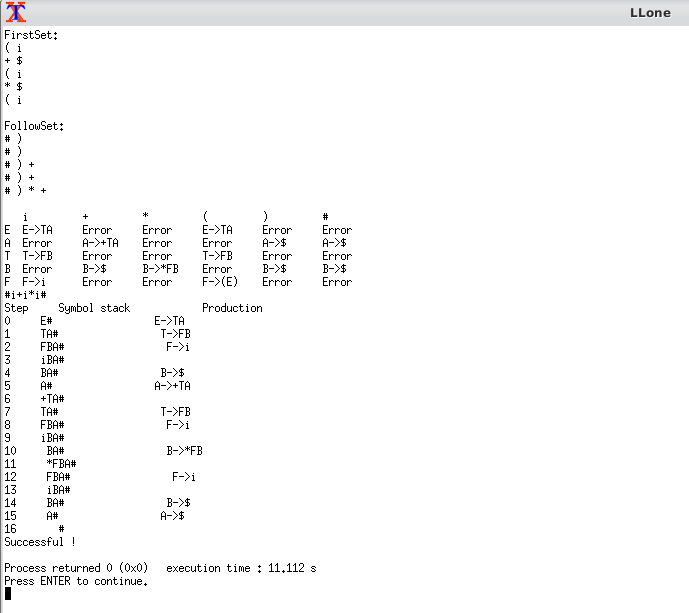

# LLone
A LL parser is a top-down parser for a subset of context-free languages. It parses the input from Left to right, performing Leftmost derivation of the sentence.

What do we have to make as input arguments or basic default value?

 - We will input "#i+i*i" to make a example for the test.
 - The default grammar products are as follows:
    - {"E", "TA"}
    - {"A", "+TA"}
    - {"A", "$"}
    - {"T", "FB"}
    - {"B", "*FB"}
    - {"B", "$"}
    - {"F", "(E)"}
    - {"F", "i"}
- The Symbol 'E' will be the start symbol

And this is the example picture:

